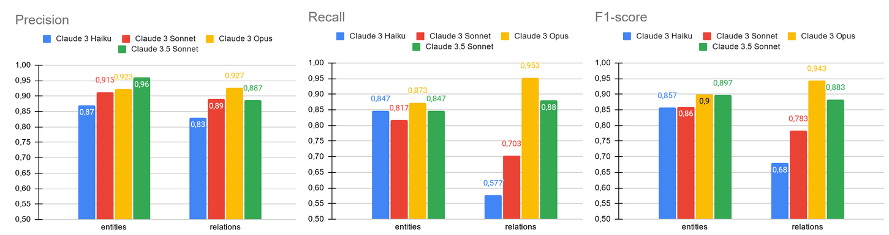
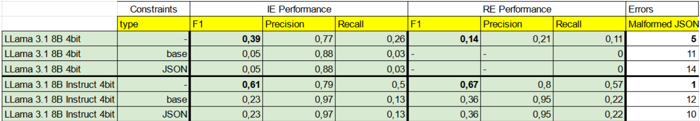
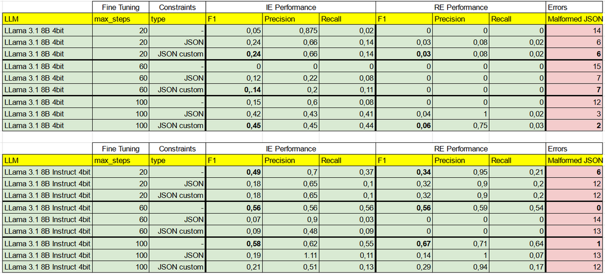

# Multe e Ricorsi, Information Extraction con LLMs

Questo repository si concentra sull'estrazione automatica di metadati dai documenti legali relativi ai ricorsi contro le multe per violazione del codice della strada.
- Vengono estratte le seguenti _entità_: "num_verbale", "targa", "mail", "data", "cf_trasgressore", "cf_avvocato", "destinatario"
- Vengono estratte le seguenti _relazioni_: "data_infrazione", "data_notifica"
- Vengono riconosciuti i seguenti articoli violati: "7", "142", "146", "148", "157", "159", "171"
- Vengono riconosciute le seguenti motivazioni del ricorso : "segnaletica", "omologazione", "taratura", "prescrizione", "carenza_dati_verbale", "lettura_errata_targa", "possesso_autorizzazione", "altro"

*N.B.: A causa di vincoli legati a un accordo di non aivulgazione aziendale, i dataset utilizzati per questa ricerca non sono disponibili al pubblico. Allo stesso modo i samples forniti via prompt, Tuttavia, i dettagli sui dataset sono riportati nella sezione Datasets.*


## Invocazione

- Usa lo script invoke.py
- Specifica il nome del modello LLM che desideri utilizzare.
- Specificail testo che vuoi elaborare.

Esempio:

```
python invoke.py --llm "anthropic.claude-3-5-sonnet-20240620-v1:0" --text "Questo è un documento di esempio."
```


### Output atteso (esempio):

```json
{
  "clf_articoli": [
    {
      "cod_articolo_violato": "146",
      "spiegazione": "Il verbale fa riferimento a un'infrazione generica senza specificare l'articolo violato. Dato che si tratta di un'infrazione rilevata automaticamente in ambito urbano, è probabile che si riferisca a una violazione della segnaletica stradale (art. 146), come ad esempio il passaggio con semaforo rosso o il mancato rispetto di un divieto di accesso."
    }
  ],
  "clf_motivazioni": [
    {
      "cod_motivazione": "altro",
      "spiegazione": "Il proprietario del veicolo dichiara che al momento dell'infrazione l'auto era concessa in noleggio a un'altra persona, fornendo i dettagli del contratto di noleggio. Chiede quindi di essere sollevato da ogni responsabilità, nonostante l'eventuale ritardo nel presentare ricorso."
    }
  ],
  "ie": {
    "entities": {
      "01/01/2011": "data",
      "11/11/2022": "data",
      "B666123666123666": "num_verbale",
      "XX666XX": "targa",
      "info@cheneso.it": "mail"
    },
    "relations": [
      {
        "relation": "data_infrazione",
        "source": "B666123666123666",
        "target": "01/01/2011"
      }
    ]
  },
  "ie_clf_mix_articolo": {
    "entities": {
      "146": "articolo_violato"
    },
    "relations": []
  }
}

```


## Fine Tuning

- cambiare parametri di fine-tuning all'occorrenza
```
..\venv\Scripts\python src\local_llama.py --llm unsloth/llama-3-8b-Instruct-bnb-4bit --ft_dataset validation --max_steps 100 --max_seq_length 4096
```

- Per altri dettagli sui parametri, digitare:
```
..\venv\Scripts\python src\local_llama.py --help
```
L'LLM finetunato verrà salvato nella cartella ./lora-model


## Evaluation:

Il processo di evaluation serve per valutare le performance tra i diversi modelli disponibili.


### Datasets:

- validation: 8 samples
- test: 18 samples
- chatgpt: 10 documenti sintetici creati con chatgpt
- claude-3-sonnet: 10 documenti sintetici creati con claude-3-sonnet
- claude-3.5-sonnet: 10 documenti sintetici creati con claude-3.5-sonnet
- claude-3-opus: 10 documenti sintetici creati con claude-3-opus

### Prompts:

Estrae le entità [num_verbale, targa, data, cf_avvocato, cf_trasgressore, destinatario, mail] e le relazioni [data_notifica, data_infrazione]:

- ie-v1-llama
- ie-v1-llama-ZERO  (per zero shot learning)
- ie-v2-claude
- ie-v3-claude
- ie-v4-claude
- ie-v5-claude
- ie-v6-claude

Classifica la motivazione del ricorso secondo le seguenti categorie [segnaletica, omologazione, taratura, prescrizione, carenza_dati_verbale, lettura_errata_targa, possesso_autorizzazione, altro]:

- clf-m-v1-claude

Classifica il tipo di violazione secondo is eguenti articoli violabili [7, 142, 146, 148, 157, 159, 171]

- clf-a-v1-claude

Estrae l'articolo violato e il comma e lega questi tramite la relazione "specifica".
A differenza di clf-a-v1-claude, qui il problema viene trattato come information extraction (più specificamente slot filling):

- ie-art-v1-claude


### Models:

- anthropic.claude-v2
- anthropic.claude-3-sonnet-20240229-v1:0
- anthropic.claude-3-haiku-20240307-v1:0
- anthropic.claude-3-opus-20240229-v1:0
- anthropic.claude-3-5-sonnet-20240620-v1:0
- meta.llama3-1-405b-instruct-v1:0
- meta.llama3-1-70b-instruct-v1:0
- meta.llama3-1-8b-instruct-v1:0
- unsloth/llama-3-8b-Instruct-bnb-4bit (local quantizzato 4 bit)


### Esegui evaluation

- eseguire da ./api-multe-ricorsi
- esempi:
```
..\venv\Scripts\python src\ie.py  --dataset test --llm anthropic.claude-3-haiku-20240307-v1:0 --ie_prompt ie-v6-claude --clf_prompt_articolo clf-a-v1-claude --clf_prompt_motivazione clf-m-v1-claude --mixed_articolo ie-art-v1-claude
..\venv\Scripts\python src\ie.py  --dataset chatgpt --llm anthropic.claude-3-haiku-20240307-v1:0 --clf_prompt_motivazione clf-m-v1-claude --mixed_articolo ie-art-v1-claude
```

- Per altri dettagli sui parametri, digitare:
```
..\venv\Scripts\python src\ie.py  --help
```
I risultati sono salvati nella cartella ./results


### Performance:
Di seguito vengono mostrate le performance per l'estrazione di entità e relazioni specificate all'inizio del readme.



*Performance su modelli closed-source*

Sono stati provati anche i [Logits Constraint](https://aclanthology.org/2023.emnlp-main.674.pdf) per mitigare le performance basse di un LLama quantizzato in locale. Allo scopo di migliorare le perforamnce mantenendo cosi bassi.
Per ulteriori dettagli fare riferimento alla presentazione nella cartella ./images



*Constraints on base GLLMs*



*Constraint: None Vs JSON Vs Customm (One-shot).*
